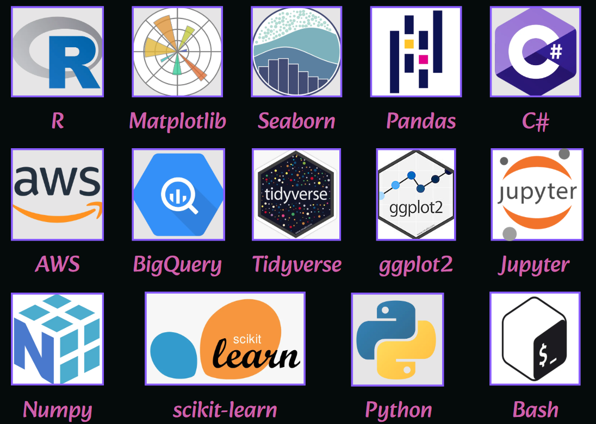

# This is my bio! (^-^)/

## My story
👾🧫 My journey into biology began with video games like Pokémon, Spore, and BioShock, which sparked a deep curiosity about evolution, genetics, and even the mechanics behind plasmids. That curiosity eventually evolved into a career where I now merge my two greatest passions: biology and computer science. I like to approach data as a puzzle by discovering patterns to transform that complex datasets into clear, actionable results. Whether collaborating with a multidisciplinary R&D team, presenting insights to stakeholders or managing my own analysis process, I bring structure, creativity and problem solving to every project.

## Milestones

### Tools I am experienced with

### Results I have achieved
✅ Built custom bioinformatics pipelines that improved research efficiency by up to **30%**.
✅ Automated microbiome analysis workflows and maintained data integrity across **1,500+ experimental records**.
✅ Developed a biological database that reduced lookup time by **10 hours per week**.
✅ Created **ETL pipelines in R** for **1000+ samples**, reducing analysis time by **35%**.
✅ Designed **3** attractive and insightful dashboards with **R shiny**.

## Did you like what you saw? Contact me!
🔍 I’m currently exploring opportunities in the data science world, where I can support research, data analysis and visualization or bioinformatics infrastructure.
If you're looking for someone fluent in data-driven biology, project execution, and collaborative problem-solving, feel free to visit my [LinkedIn profile](https://www.linkedin.com/in/lorenamartindorta/) or you could write me at loremd99@outlook.com ☺️
